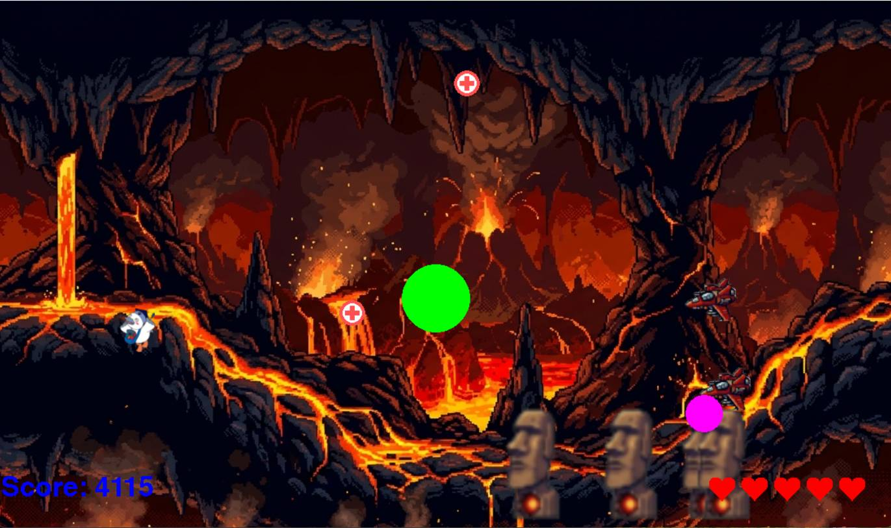
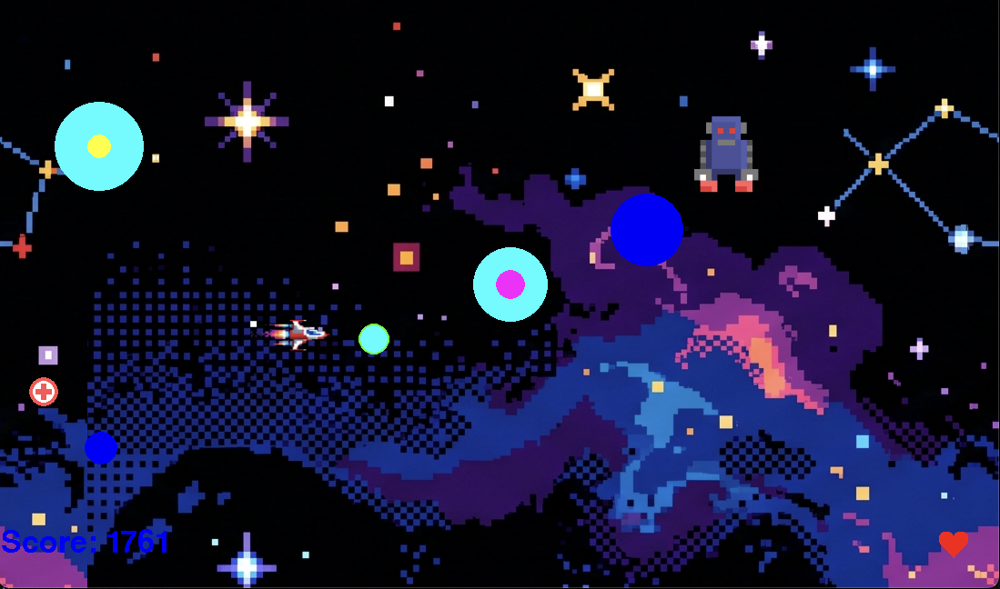

# 横シューティングゲーム

## 実行環境の必要条件
* python >= 3.10
* pygame >= 2.1

## ゲームの概要
* 自機を操作して敵を倒し、時間経過で次の階層へ進む。毎階層ごとにスキルが選べる。5階層クリアでゲームクリア。
* 参考URL：[CS(2026_C22804)](https://service.cloud.teu.ac.jp/moodle_epyc/pluginfile.php/895742/mod_resource/content/0/ProjExD_5_20260519.pdf)
* 自機を操作して「階層」を登っていく。毎階層ごとにスキルが選べる。最終階層までいくとエンディングが見れる。

## ゲームの遊び方
* 矢印キーで自機を操作し，スペースキー押下による弾丸で敵を撃つ
* 敵に当たるとゲームオーバーとなる
* 操作キー WASD , SPACE発射 , Q/E/Rスキル

## ゲームの実装
### 共通基本機能
* 背景画像ok
* 自機の移動 ok
* 弾丸の発射(味方/敵) ok
* 敵(弾を撃つ) ok
* アイテムオブジェクトok
* スキル選択ok
* 強制スクロールok
* ステージの端に着いたら、スキル選んで次の階層へok
* スコア ok
* HPはデフォルト3 ok

### 分担追加機能
### Stage1
#### 敵
1. ボス追加
2. 一定時間経過で上下に移動し爆弾を発射する
#### ステージ
1. 背景追加
2. bgm追加
3. ボスを倒したら次のステージへ
### Stage2
#### 敵
1. 動きを不規則に
2. 爆弾の量を増やす
3. 敵の画像を変える
4. ボスは右に固定
#### ステージ
1. BGM追加
2. 背景画像を変える
3. ボスは最後に、倒したら次のステージへ
### Stage3
#### 敵
1. ボス追加
2. ボスは扇状に爆弾を投げる
#### ステージ
1. bgm追加
2. 背景画像を変える
3. ボスは12sec後に出現、倒したら次へ
### Stage4
#### 敵
1.新規敵2体
2.ボス追加
3.ボスは炎を連射する
#### ステージ
1. 時間経過でボス出現
2. ボスを倒したらステージクリア/移行

### Stage5 - C0A25186
#### 敵
1. 隕石 弾を発射しない 画面上をランダムに登場
2. ブルースクエア 弾を発射してくる 同時に三体でる 後ろに戻る
3. ボスロボット HP30 弾を連射してくる 画面上をランダムに登場
#### ステージ
1. ある程度時間が経つとボスがわく。ボスがいる時は敵が沸かない
2. ボスを倒したらclear point+1000 game終了
3. 時間経過終了をlevel5で飲み廃止
#### 追加機能
1. 新スキル 移動速度x2 常時

#### 全員
各自が好きなように
1. 一人一つのボス
2. 一人一つのステージ(BGM)
3. 一人一つのスキル
を作る。(5人5層)

### メモ
1. enemyはコピーして作成しspawn_enemy関数で出現させられる
2. 階層ごとの背景はbackgroundImgで配列管理
